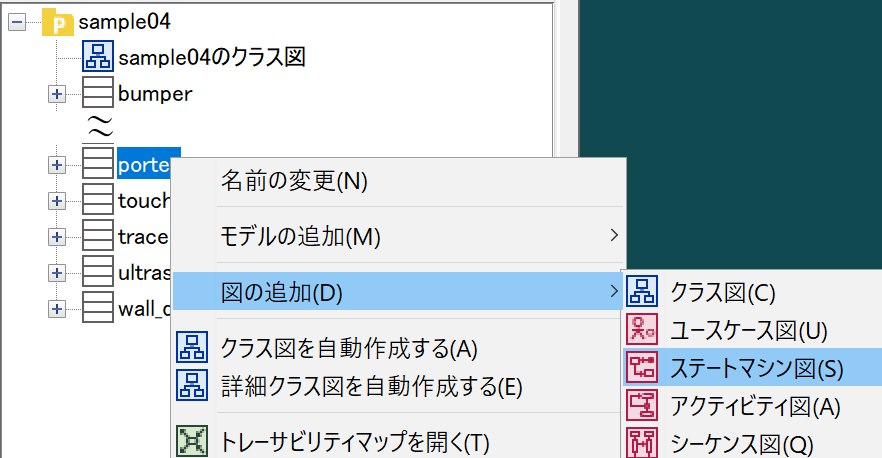
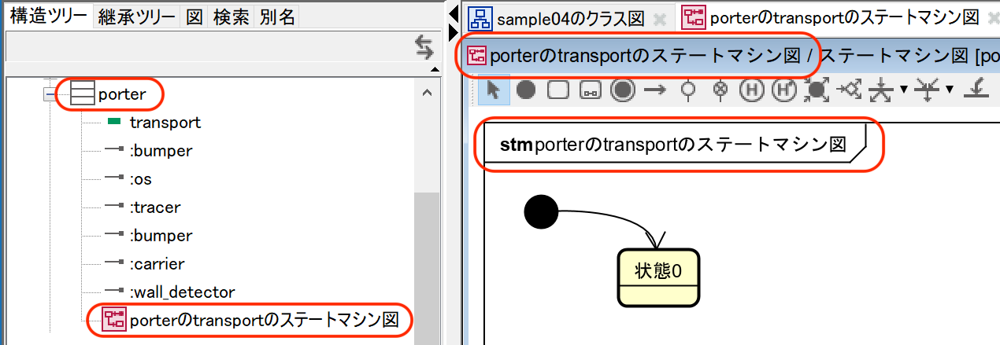
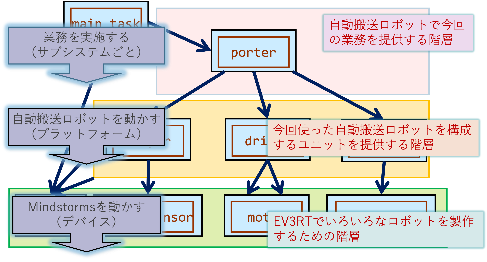

:encoding: utf-8
:lang: ja
:scripts: cjk
:media: prepress
:linkcss:
:stylesdir: css
:stylesheet: mystyle.css
:sectanchors:
:autofit-option:
:experimental:
:support-uri:
:original-support-uri:
:twoinches: width='360'
:full-width: width='100%'
:three-quarters-width: width='75%'
:two-thirds-width: width='66%'
:half-width: width='50%'
:half-size:
:one-thirds-width: width='33%'
:one-quarters-width: width='25%'
:thumbnail: width='60'
:imagesdir: images
:sourcesdir: codes
:icons: font
:hide-uri-scheme!:
:figure-caption: 図
:example-caption: リスト
:table-caption: 表
:appendix-caption: 付録
:xrefstyle: short
:section-refsig:
:chapter-refsig:

= サンプルモデルの動作とモデル図の作成

NOTE: この演習は、グループで相談しつつ、各自が実施します。

== 演習場所を調整する

=== EV3RTのワークスペースにcloneする

このAssignmentでは演習でEV3RTのプログラムをビルド（make）します。
そのため、サンプルコードをEV3RTの開発環境に配置しておかないと不自由です。
そうなるように、cloneする場所を EV3RT のワークスペースとなる場所に調整します（そうでない場所にcloneしてしまった場合は、調整場所に移動しましょう）。

具体的には、 `sdk/workspace` の「並び」に配置します。
次のように、 `sdk` ディレクトリに移動してからcloneを実行します。

[[assignment_location01]]
.`sample_code_and_model/` をワークスペースの位置に配置する
[source,shell]
----
$ cd {EV3RTの置き場所}/hrp3/sdk # <1>
$ git clone {受理したAssigmentのURL} # <2>
----
<1> EV3RTの `sdk` ディレクトに移動した。演習の指示通りなら「EV3RTの置き場所」は `/c/ev3rt` だろう。
<2> 例えばアカウント名が `abcd` なら、 `https://github.com/cit-prjex/sample-code-and-model-abcd.git` のようになるだろう。

`workspace` と同じ階層（ `sdk` の下）に配置されたことを確認します。
例えば、 cloneしたリポジトリが `sample-code-and-model-abcd` ならば、 <<assignment_location02>> のよな配置になります。

[[assignment_location02]]
[source,shell]
.cloneしたリポジトリの配置を確認する
----
$ pwd # <1>
{EV3RTの置き場所}/hrp3/sdk
$ tree -L1
{EV3RTの置き場所}/hrp3/sdk
├── （その他のいろいろ）
├── sample-code-and-model-abcd # <2>
└── workspace
----
<1> カレントディレクトリ（現在のディレクトリ）を `sdk` に移動したことを確認。
<2> cloneしたリポジトリ（のディレクトリ）があることを確認する。

=== Makefileをworkspaceからコピーする

`workspace` の中にあるMakefileがないと、EV3RTのワークスペースとして機能しません。
そこで、`workspace` の中の `Makefile` をcloneしたリポジトリにコピーします。
ターミナルから実行してもよいですし、Windows のExploreを使ってコピーしてもかまいません。

[source,shell]
.`Makefile` をコピーできたか確認する
----
$ pwd
{EV3RTの置き場所}/hrp3/sdk/クローンしたディレクトリ # <1>
$ ls -1 # <2>
README.adoc
いろいろ）
Makefile # <3>
----
<1> カレントディレクトリ（現在のディレクトリ）が、cloneしたディレクトリに移動してあることを確認。
<2> `ls` コマンドを `-1` （エルではなく `1` ）で実行した。
<3> Makefileがコピーできていいることを確認した。

== sample01のモデル図を作る

=== 【演習】sample01を動かす

==== sample01をビルドして実行しなさい

`sample01` をビルドして、実行しなさい。

[[make_sample01]]
.`sample01` をビルドする
[source,shell]
----
$ make app=codes/sample01 # <1>
----
<1> `sample01` があるのは `codes` の中なので。

==== sample01のコードを参照しなさい

.`sample01/app.c` （コードファイルへの参照リンク）
link:codes/sample01/app.c[]

NOTE: 下記 `include` ディレクティブが参照でないときは、上記リンクをたどるなり、自分でファイルを開くなりして直接ファイルを参照しなさい。

[[sample01_app_c]]
.`sample01/app.c`
[source,c,linenums]
----
include::{sourcesdir}/sample01/app.c[]
----
<1> `main_task` は、PCのプログラムの `main` 関数の代わり（名前は自由、`app.cfg` でタスク定義のなかで指定した関数名に合わせる）。
<2> モーターの初期化。ポートAとCラージモーターを接続し、ポート1にタッチセンサーを接続する。
<3> ポートA,Cのモーターをパワー20で正回転させる。
<4> ポート1のタッチセンサーが押されたかどうか調べ、押されるまで繰り返す。
<5> 20*1000マイクロ秒＝20ミリ秒このタスクをスリープする（モーターは回り続ける）
<6> ポートA,Cのモーターをパワー20で逆回転させる。
<7> ポートA,Cのモーターを停止する。
<8> タスクの終了をOSに伝える。

=== 【演習】astah*でsample01のクラス図を作る

==== astah*で新規にプロジェクトを作成しなさい

. astah* を起動する。
. 「ファイル＞プロジェクトの新規作成」で、新しいプロジェクトを作成する。
. 作成したプロジェクトを「ファイル＞プロジェクトを保存」で保存する。
** ファイル名は「sample01（ `sample01.asta` ）」とする。
** 「デスクトップ」または自分が作成したフォルダ（たとえば「プロジェクト演習」フォルダなど）に保存する

==== プロジェクトにクラス図を追加しなさい

. 「図＞クラス図」を実行してクラス図を追加する。
** エディタのタイトルやタブのタイトルが追従して変更される。

.図の名前を変更する
image::GSW-20190930-002210_0.png[{three-quarters-width}]

==== sample01のクラス図を作成しなさい

指示に従って、 `sample01/app.c` のコードを参照して、クラス図を作成しなさい。

. 「モノ」を抜書きしてクラスとして配置する。
**  `motor` 、 `touch_sensor` など
** `main_task` は関数なので働きとしたいが、この演習では特別なモノとして扱う。
** 「OS」をクラスとして追加する。
. 「働き」を抜書きして、その働きの主体となるクラスの操作に追加する。
** たとえば、`ev3_set_motor_power` なら、`set_power` 。 ここで  `ev3` はライブラリ名なので割愛し、 `motor` はモノに挙げたので割愛して、残りの `set_power` を働きとして抜き書きして操作に追加する。
. 働きを使っている側から働きを提供している側へ矢印つきの関連を引く。
** 関数の中で呼び出している関数があれば、呼び出している側の関数を働きとして持つクラスが矢印の元、中で呼び出されている側の関数の働きを操作として持つクラスが矢印の先。

==== sample01のクラス図を保存しなさい

クラス図を作成したら保存しなさい。

. 「ツール＞画像出力＞現在の図」で、保存用ダイアログを開く。
. 作成したクラス図を `sample01_class_01.png` として `images` ディレクトリに保存する（ダミー画像ファイルになっているので、置き換える）

.`sample01` のクラス図（保存できたら置き換わる）
image::sample01_class_01.png[{full-width}]

==== 編集結果をコミットする

クラス図を保存したら、ターミナルからgitコマンドを使ってコミットしなさい。

==== 編集結果をプッシュする

クラス図を保存したら、ターミナルからgitコマンドを使って、プッシュできるか確認しなさい。

[source,shell]
----
git status
// ここに上記コマンドの実行結果（画像ではなくテキスト）を貼り付ける
----

問題がなければプッシュしなさい。問題があれば、TAに相談しなさい。

[source,shell]
----
git push
// ここに上記コマンドの実行結果（画像ではなくテキスト）を貼り付ける
----

また、 `git log` を実行して過去の処理について確認しなさい。

[NOTE]
--
このソース（ `README.adoc` ）は、GitHubのリポジトリのフロントページに表示される。
ローカル（自分のPC）でもプレビューしたい場合は、 `README.adoc` をVisual Studio Codeのプレビューで確認してください。
--

== sample04のモデル図を作る

=== 【演習】sample04を動かす

==== sample04をビルドして実行しなさい

`sample04` をビルドして、実行しなさい。

[[make_sample04]]
.`sample04` をビルドする
[source,shell]
----
$ make app=codes/sample04 # <1>
----
<1> `sample04` があるのは `codes` の中なので、そこを指定してビルドした。

`sample04` は、次のように動作する。

.自動搬送ロボットが荷物を運搬する
. 自動搬送ロボットは、プログラムを起動すると荷物が載せられるのを待つ。
. 荷台が荷物が載せられたと認識すると、自動搬送ロボットは経路に沿って荷物を運搬する。
. 側壁監視部が壁を認識すると、自動搬送ロボットは配達先に着いたとみなして停止する。
. 荷台が荷物が降ろされたことを認識すると、自動搬送ロボットは経路に沿って車庫へ回送する。
. バンパーが押されると、自動搬送ロボットは、車庫についたとみなして停止する。

.参考動画（sample04に例外処理を追加したもの）
https://youtu.be/MUhdS54vkU0[sample04.mp4(youtube)]

うまく動かないと思う場合は、次の節を参考に、センサーの閾値などを調整しなさい。

==== sample04のソースコードを参照しなさい

.`sample04/app.c` （コードファイルへの参照リンク）
link:codes/sample04/app.c[]

NOTE: 下記 `include` ディレクティブが参照でないときは、上記リンクをたどるなり、自分でファイルを開くなりして直接ファイルを参照しなさい。

[[sample04_app_c_1]]
.`sample04/app.c`(1)（冒頭部分を抜粋）
[source,ruby,linenums]
----
include::{sourcesdir}/sample04/app.c[lines=1..27]
----
<1> ポート2のタッチセンサーに `carrier_sensor` という名前をつけた。
<2> 荷台（ `carrier` ）クラスに、荷物が載ったかどうか調べる操作 `cargo_is_loaded` を追加し、それをCの関数 `carrier_cargo_is_loaded` として実装した。
<3> ポート4の超音波センサーに `walldetector_sensor` という名前をつけた。
<4> 側壁との距離のしきい値（Threshold）の定数にマクロで名前をつけた。
<5> 側壁との距離の現在のしきい値ほ保持する変数 `wd_distance` を定義した。
<6> 側壁監視部（ `wall_detector` ）クラスに、側壁が見つかったどうか調べる操作 `is_detected` を追加し、それをCの関数 `wall_detector_is_detected` として実装した。

[[sample04_app_c_2]]
.`sample04/app.c` (2)（ `porter_transport` 部分を抜粋）
[source,ruby,linenums]
----
include::{sourcesdir}/sample04/app.c[lines=65..135]
----
<1> 状態を表す定数を `enum` で定義した。
<2> 定義した定数を `porter_state` 型として `typedef` した。
<3> `porter_state` 型で現在の `porter` の状態を保持する変数 `p_state` を定義した。
<4> `porter` の各状態の `entry` の処理（その状態に入った1回目だけやる処理）の判定用の変数 `p_entry` を定義した。
<5> 荷物が載ったかどうか（ `carrier_cargo_is_loaded()` が真か）を調べる。
<6> 現在の状態を次の状態に変更する（繰り返しの次の `switch` 文に入る際にその `case` に移る）。
<7> 現在の状態から抜けるときは、`entry` 処理を実行するよう設定する。
<8> `porter` の各状態の `exit`の処理（現在の状態から抜けるときに実行する処理）があれば、ここに書く。

=== クラス図とコードの対応関係

このコードは、 <<traslation_rule_guide>> のようなクラス図とコードの対応関係で作成されている。
この対応関係を参考にしてクラス図とステートマシン図を作成する演習を実施しなさい。

[[traslation_rule_guide]]
.クラス図とコードの対応づけ
image::traslation_rule_guide.png[{full-width}]

=== 【演習】astah*でsample04のクラス図を作る

==== samlple04のクラス図の情報を抽出する

クラスの候補（モノ）を下記に列挙しなさい（クラスの候補になるものでよい）

.クラスの候補（下記リストを書き換える）
* main_task
* motor
* クラス候補のモノA
* クラス候補のモノB

操作の候補（働き）の候補を列挙しなさい（候補でよい）。
もし、クラスが決定できるなら、後のかっこ内に記載しておきなさい。

.操作の候補（下記リストを書き換える）
. set_poweer（motor）
. 操作候補の働き1（クラス候補A）
. 操作候補の働き2（クラス候補B）

関連の候補（クラス間のつながり）を下記に列挙しなさい（候補でよい）

.関連の候補（下記リストを書き換える）
. main_task -> transporter
. クラス候補 -> クラス候補

==== sample04のプロジェクトを作成する

. `sample01` のastah* のプロジェクトを複製して `sample04` のプロジェクト（ `sample04.asta` ）を作りなさい。
. クラス図の名前を「sample01のクラス図」から「sample04のクラス図」に変更しなさい。

==== sample04のクラス図を作成する

. 指示にしたがって、`sample04` のクラス図を作成しなさい。
**  既存のクラスが使える場合にはそれを使う。
**  不足するクラスは追加する。

==== クラス図にパッケージを追加する

. 指示にしたがって、`sample04` のクラス図にパッケージを追加しなさい。
**  どんなパッケージが追加されたか。
**  それぞれのパッケージには、どんなクラスが含まれるか。

==== sample04のクラス図を保存しなさい

作成したクラス図を `sample04_class_01.png` として `images` ディレクトリに保存しなさい。

. 「ツール＞画像出力＞現在の図」で、保存用ダイアログを開く。
. 作成したクラス図を `sample04_class_01.png` として `images` ディレクトリに保存する（ダミー画像ファイルになっているので、置き換える）

<<sample04_class_01>> が作成したクラス図で置き換えられたことを確認しなさい。

[[sample04_class_01]]
.`sample04` のクラス図（その1）（保存できたら置き換わる）
image::sample04_class_01.png[{full-width}]

==== 編集結果をコミットする

ここまで編集したら、このファイル（ `README.adoc` ）を保存し、ターミナルからgitコマンドを使ってコミットしなさい。

==== 残りのクラスも追加してクラス図を更新しなさい

. `sample04` に登場する他のクラスと操作についても、クラス図に追加しなさい。
. ひとつのクラスについて、クラス図にクラスと操作を追加した都度、モデル図ファイルを保存し、コミットしなさい。

クラス図を更新したら、クラス図の画像を `sample04_class_02.png` として書き出しなさい。

<<sample04_class_02>> が書き出した画像で置き換えられていることを確認しなさい。

[[sample04_class_02]]
.`sample04` のクラス図（その2）（保存できたら置き換わる）
image::sample04_class_02.png[{full-width}]

==== 編集結果をプッシュする

作成したastahのプロジェクトファイル（ `.asta` ）、astahから出力した画像ファイル、このファイル（ `README.adoc` ）を保存し、ターミナルからgitコマンドを使ってコミットしなさい。

コミットできたら、リポジトリをプッシュしなさい。

=== 【演習】astah*でsample04のステートマシン図を作る

==== ステートマシン図の関心事

ステートマシン図は、次のようなことに関心を持つ。

.ステートマシン図の特徴
* 状態とイベントに着目して振舞いを整理する図。
* できごと（イベント）を待っている場所を「状態」と捉える。
* 待っている状態でイベントが発火したときに次の状態へ「状態遷移」する。
* イベントが発生（発火）したときに実行する処理が「アクション」。
** イベントにアクションが紐づいている場合、アクションを実行してから次の状態に遷移する。
** 状態にアクションが紐づいている場合、状態が遷移し、それから遷移先の状態のアクションが実行される。

==== ステートマシン図を描く順序

ステートマシン図をうまく描くには、描く順序があります。

[IMPORTANT]
.状態名は後回し
--
ステートマシン図で重要なのは、起きるのを待っているできごとをイベントを特定し、状態遷移を描くことと、そのイベントで遷移した状態において実行するアクションを特定すること。

そのため、**作図の当初は状態名をつけない** で描く。
先にイベントやアクションを描き、それらのイベントやアクションに基づいて状態名をつける。
--

==== sample04のプロジェクトにステートマシン図を追加する

`porter` クラスの `transport` メソッドの振舞いをステートマシン図で表してみよう。

.Sample04のporterクラスにステートマシン図を追加する
. モデルファイル `sample04.asta` をひらく。
. 構造ツリーから `porter` を選択した状態で、右クリックしてポップアップメニューを開く。
. 「図の追加＞ステートマシン図」で `porter` クラスにステートマシン図が追加される。
. ステートマシン図の名前を「 `porter` の `transport` のステートマシン図」に変更しておく。

[[add_stm_diagram]]
.`porter` クラスにステートマシン図を追加する
]

[[add_stm_name]]
.ステートマシン図に名前をつける
]

==== ステートマシン図に状態・状態遷移・アクションを追加する

ステートマシン図を描く順序にしたがって、`porter` の運搬業務のステートマシン図を作成する。

追加したステートマシン図に、運搬業務に応じた状態とアクション、状態遷移とイベントを追加する。

.イベントやアクションの捉え方
. 状態名はあとでつける。
. 「〜が起きたら」を「〜が起きた、なった、経った」と読み替えて、状態遷移のイベントにする。
. 「〜をする」を遷移先の状態のアクションに記載する。
. イベントとアクションが書けたら、状態名をつける（だいたい次のいずれか）。
** いちばん期待しているイベント（またはそれが起きることを示す業務上のできごと）を使って「〜待ち」とつける。
** イベントが起きるのを待っている間の処理（またはそれを示す業務上の作業名）を使って「〜中」とつける。
** 最後の状態は、イベントを待たないし、継続する処理もないので、「完了、終了、到着」といった名前をつける。

.作成中のステートマシン図
image::GSW-20191021-142110.png[{three-quarters-width}]

==== 状態名をつける

それぞれの状態遷移と待っているイベント、状態とアクションが描けたら、状態名をつける。

==== sample04のステートマシン図を保存する

作成したクラス図を `sample04_stm_01.png` として `images` ディレクトリに保存しなさい。

.`sample04` のステートマシン図（保存できたら置き換わる）
image::sample04_stms_01.png[{full-width}]

==== 編集結果をコミットする

ステートマシン図を保存したら、ターミナルからgitコマンドを使ってコミットしなさい。

==== 編集結果をプッシュする

ステートマシン図を保存したら、ターミナルからgitコマンドを使って、プッシュしなさい。

=== 階層化アーキテクチャの発見

見直したコードやクラス図には、 `Porter` クラス、 `Driver` クラス、 `Bumper` クラスなどが追加できた。
`sample01` では、センサーやモーターを直接利用したが、ロボットのユニットやアプリケーションの処理が見えるかたちに変わった。

この検討の結果から、 <<layered_arch_01>> のような階層化アーキテクチャが見いだせる。

[[layered_arch_01]]
.モデル図を作成した結果発見した階層化アーキテクチャ

=== タイマーとホーン

「2秒経過した」という動作は、他に何もすることがなければ `sample01` のときのように `tslp_tsk` を使えばできる。
しかし、これはプログラムをスリープさせているので、他の処理も動作しない。
他の処理を実行しながら時間の経過を待つには、別の方法が必要となる。

タイマーは、一定の時間経過を調べるためのしくみとしてよく使われる。
この演習用の簡単なタイマーを用意したので、これを試してみよう。

.タイマーのサンプルを動かす
. GoogleDriveのEV3RT関連にある `timer02.tar.gz` を `workspace` へコピーして、 `tar` コマンドで展開する（ `timer02` ディレクトリが  `workspace` の下に置かれる）。
. `unil` の中に、`timer.h` と `timer.c` があることを確認する。
** もしなければ、GoogleDriveのEV3RT関連にある `util.tar.gz` を展開すれば得られる。

.タイマークラス
image::timer.png[{one-quarters-width}]

タイマークラスの動作について、説明を聞いて実行する。

タイマーの他に、あらかじめ決まった音（到着音、確認音、警告音）を鳴らすホーンクラスも用意している。

.ホーンクラス
image::horn.png[{one-quarters-width}]

NOTE: 簡便なクラスなので、それぞれの音を再生中は他の動作を変えられないことに注意する。

=== タイマーとホーンを使う

<<timer_horn_usage>> にタイマーとホーンを使うステートマシン図の表記とコードの対応づけの例を示す。

[[timer_horn_usage]]
.timerとhornの利用例
image::timer_horn_usage02.png[{full-width}]

=== 【演習】配達先で到着を鳴らす

配達先や車庫に到着したら、到着音を鳴らすように、sample04を改造しなさい。

NOTE: おおむね、<<timer_horn_usage>> を真似れば実現できるはず。

==== sample04-01のプロジェクトを作成する

. `sample04` のastah* のプロジェクトを複製して `sample04-01` のプロジェクト（ `sample04-01.asta` ）を作りなさい。
. クラス図の名前を「sample04のクラス図」から「sample04-01のクラス図」に変更しなさい。

==== sample04−01のクラス図を作成する

. 指示にしたがって、`sample04-01` のクラス図を作成しなさい。
**  既存のクラスが使える場合にはそれを使う。
**  不足するクラスは追加する。
** もしパッケージの修正や追加が必要なら、そうしなさい。

==== sample04−01のクラス図を保存しなさい

作成したクラス図を `sample04−01_class_01.png` として `images` ディレクトリに保存しなさい。

. 「ツール＞画像出力＞現在の図」で、保存用ダイアログを開く。
. 作成したクラス図を `sample04−01_class_01.png` として `images` ディレクトリに保存する（ダミー画像ファイルになっているので、置き換える）

<<sample04_01_class_01>> が作成したクラス図で置き換えられたことを確認しなさい。

[[sample04_01_class_01]]
.`sample04-01` のクラス図（その1）（保存できたら置き換わる）
image::sample04-01_class_01.png[{full-width}]

==== 編集結果をコミットする

ここまで編集したら、このファイル（ `README.adoc` ）を保存し、ターミナルからgitコマンドを使ってコミットしなさい。

NOTE: `git log` コマンドを使えば、履歴にコミット結果が追加されていることを確認できる。

==== sample04−01のステートマシン図を作成する

. `sample04` のステートマシン図の作成手順を参考に、 `sample04-01` のステートマシン図を作成しなさい。
** もし既存のクラスの操作等に修正や追加が必要なら、そうしなさい。

==== sample04−01のステートマシン図を保存する

作成したクラス図を `sample04-01_porter_stm_01.png` として `images` ディレクトリに保存しなさい。

<<sample04_01_stm_01>> が作成したクラス図で置き換えられたことを確認しなさい。

[[sample04_01_stm_01]]
.`sample04-01` のステートマシン図（保存できたら置き換わる）
image::sample04-01_stms_01.png[{full-width}]

==== 編集結果をコミットする

ステートマシン図を保存したら、ターミナルからgitコマンドを使ってコミットしなさい。

==== 編集結果をプッシュする

ステートマシン図を保存したら、ターミナルからgitコマンドを使って、プッシュしなさい。

=== 【演習】荷物の積載待ちで確認音を鳴らす

* 荷物を受け取らずに10秒経過したら、確認音を鳴らすように、sample04-01を改造しなさい。
* その後も、10秒経過するたびに鳴るようにしなさい。

NOTE: おおむね、<<timer_horn_usage>> を真似れば実現できるはず。

==== sample04-02のプロジェクトを作成する

. `sample04-01 のastah* のプロジェクトを複製して `sample04-02` のプロジェクト（ `sample04-02.asta` ）を作りなさい。
. クラス図の名前を「sample04-01のクラス図」から「sample04-02のクラス図」に変更しなさい。

==== sample04−01のクラス図を作成する

. 指示にしたがって、`sample04-02` のクラス図を作成しなさい。
**  既存のクラスが使える場合にはそれを使う。
**  不足するクラスは追加する。
** もしパッケージの修正や追加が必要なら、そうしなさい。

==== sample04−02のクラス図を保存しなさい

作成したクラス図を `sample04−02_class_01.png` として `images` ディレクトリに保存しなさい。

. 「ツール＞画像出力＞現在の図」で、保存用ダイアログを開く。
. 作成したクラス図を `sample04−02_class_01.png` として `images` ディレクトリに保存する（ダミー画像ファイルになっているので、置き換える）

<<sample04_02_class_01>> が作成したクラス図で置き換えられたことを確認しなさい。

[[sample04_02_class_01]]
.`sample04-02` のクラス図（保存できたら置き換わる）
image::sample04-02_class_01.png[{full-width}]

==== 編集結果をコミットする

ここまで編集したら、このファイル（ `README.adoc` ）を保存し、ターミナルからgitコマンドを使ってコミットしなさい。

NOTE: `git log` コマンドを使えば、履歴にコミット結果が追加されていることを確認できる。

==== sample04−02のステートマシン図を作成する

. `sample04` のステートマシン図の作成手順を参考に、 `sample04-02` のステートマシン図を作成しなさい。
** もし既存のクラスの操作等に修正や追加が必要なら、そうしなさい。

==== sample04−02のステートマシン図を保存する

作成したクラス図を `sample04-02_porter_stm_01.png` として `images` ディレクトリに保存しなさい。

<<sample04_02_stm_01>> が作成したクラス図で置き換えられたことを確認しなさい。

[[sample04_02_stm_01]]
.`sample04-02` のステートマシン図（保存できたら置き換わる）
image::sample04-02_stms_01.png[{full-width}]

==== 編集結果をコミットする

ステートマシン図を保存したら、ターミナルからgitコマンドを使ってコミットしなさい。

==== 編集結果をプッシュする

ステートマシン図を保存したら、ターミナルからgitコマンドを使って、プッシュしなさい。

== 振舞いのモデルとコードの対応のまとめ

* コードの構造と振舞いを図で表してみた
* 情報隠蔽
** 責務のわかるクラス名をつけたクラスを用意した
* ドメイン分割
** 複数のクラスが所属するドメインに分け、ドメインをパッケージに割り当てた
* ホーンとタイマーを使ってみた
